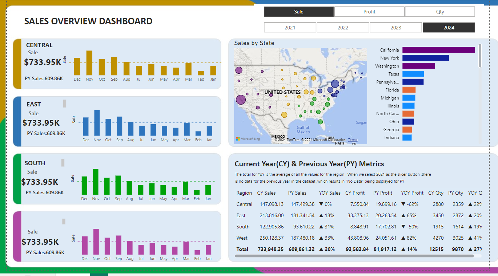

Here’s your `README.md` file in markdown format:

```markdown
# Power BI Sales Overview Dashboard

This project showcases a **Sales Overview Dashboard** built using **Power BI**. The dashboard is designed to provide clear and actionable insights into sales performance across various regions and states in the United States. It allows users to analyze data from 2021 to 2024, comparing current year (CY) and previous year (PY) metrics.

## Dashboard Highlights

### Key Features
- **Regional Sales Analysis**:
  - Breaks down sales by four regions: **Central**, **East**, **South**, and **West**.
  - Displays sales, profit, and quantity metrics for each region.
- **Year-over-Year (YoY) Metrics**:
  - Compares sales, profit, and quantity between the current year (CY) and the previous year (PY).
  - Highlights YoY percentage changes.
- **Interactive Map**:
  - Visualizes sales data by state across the U.S.
  - Color-coded markers for quick regional insights.
- **State-Level Rankings**:
  - Bar chart showing the top-performing states in terms of sales.
- **Monthly Trends**:
  - Displays monthly sales trends for each region.

### Interactive Slicers
Users can dynamically filter the data by selecting specific years (2021-2024). This feature allows for comparative analysis across different time periods.

## Dashboard Components

### 1. Regional Sales Panels
Each region has a dedicated panel showing:
- Total sales.
- Previous year's (PY) sales.
- Monthly sales trend visualization.

### 2. Sales by State
- A **map visualization** highlighting sales distribution across states.
- Allows users to identify sales hot spots and underperforming regions.

### 3. Comparative Metrics Table
- **CY vs PY**: Detailed metrics for each region including:
  - Sales, profit, and quantity values.
  - YoY growth percentages.
- Totals for all regions combined are displayed at the bottom.

## Installation and Usage

1. **Clone the Repository**:
   ```bash
   git clone https://github.com/YourUsername/Power-bi-dashboard.git
   ```
2. **Open in Power BI Desktop**:
   - Download and install [Power BI Desktop](https://powerbi.microsoft.com/).
   - Open the `.pbix` file included in this repository.
3. **Connect Data Sources**:
   - Ensure all necessary data sources are available and properly linked.

## Data Source
The dashboard uses sales data that includes the following fields:
- Region
- State
- Monthly Sales
- Profit
- Quantity
- Year

## Customization
- Add additional years or datasets as needed.
- Update visualizations or metrics to reflect specific business requirements.

## Screenshots

### Dashboard Preview


## Contributing
Contributions are welcome! Feel free to fork this repository, make your changes, and submit a pull request.

## License
This project is licensed under the MIT License. See the [LICENSE](LICENSE) file for more information.

## Contact
For questions or further assistance:
- **Email**: mymsharaff@gmail.com
```

