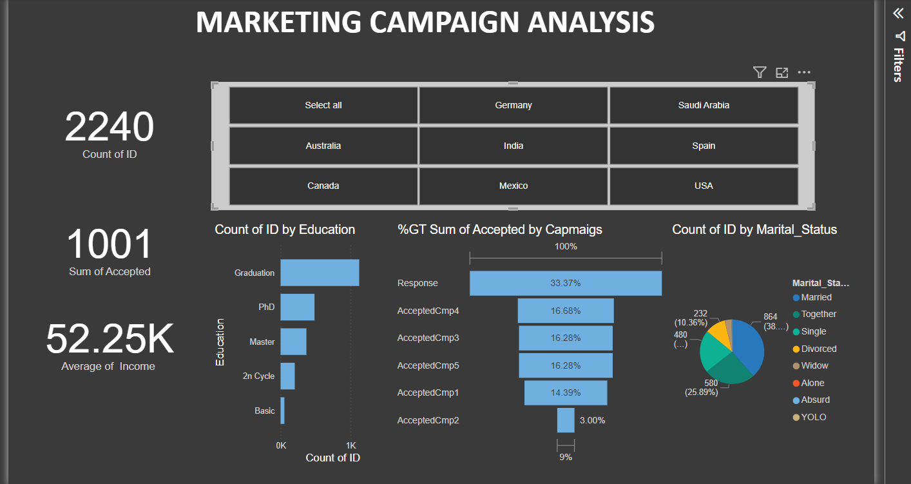

# Marketing Campaign Analysis Dashboard

This dashboard provides an overview of a marketing campaign's performance. It includes the following key insights:

- **Count of IDs**: Total number of participants in the campaign.
- **Sum of Accepted**: Total number of campaign acceptances.
- **Average Income**: Average income of the participants.

## Key Visualizations

1. **Filters by Country**: 
   - Select participants from countries like Germany, India, USA, etc.
2. **Count of IDs by Education**:
   - Visualizes the distribution of participants by education level.
3. **Sum of Accepted by Campaigns**:
   - Displays the percentage distribution of responses across campaigns.
4. **Count of IDs by Marital Status**:
   - Highlights the marital status distribution using a pie chart.

## Features
- Interactive filters for country selection.
- Clear visualization of campaign success and participant demographics.

## Usage
Clone this repository to explore insights and adapt the dashboard as needed for your projects.

---
